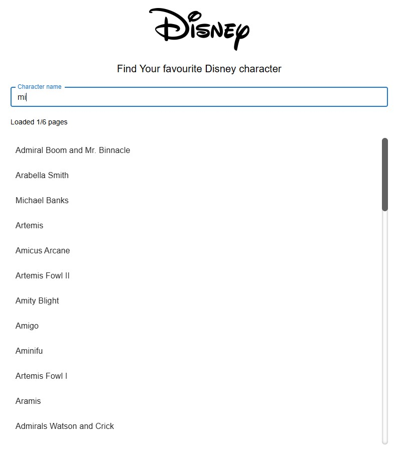
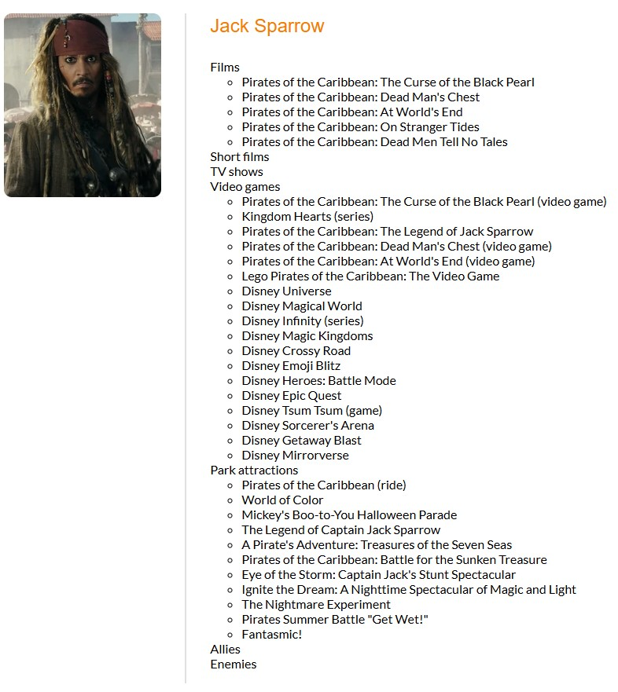

# Project Title

Disney Characters Browsing App.
This is a simple app that allows users to browse Disney characters.

<p align="center">
  
&nbsp; &nbsp; &nbsp; &nbsp;
  
</p>

## Features

-   Searching Disney characters
-   Details about a specific Disney character

## Tech Stack

-   React
-   TypeScript
-   Vite
-   TanStack Query

### Additional libraries

-   Material UI
-   React Window
-   React Window Infinite Loader

### Testing tools

-   Vitest
-   React Testing Library

### Additional tools

-   ESlint
-   Prettier
-   Husky

## How to use

1. Clone the repo

```bash
git clone https://github.com/PiotrKoszelak/Disney-Characters-Browsing-App.git
```

2. Install dependencies

```bash
npm install
```

3. Add .env file inside the root directory

```bash
VITE_CLIENT_PORT=<YOUR CUSTOM CLIENT PORT>
```

4. Start the dev server

```bash
npm run dev
```

## License

This project is open source and available under the [MIT License](LICENSE).
